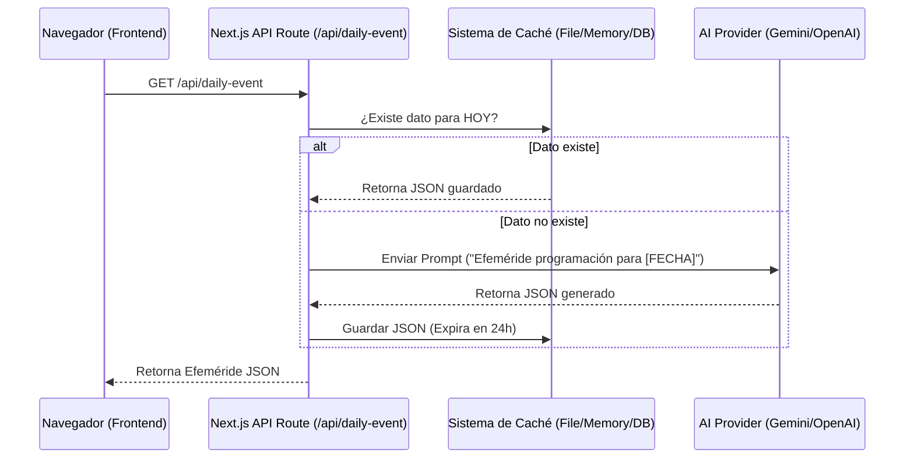

# 📘 SDLC: Integración de IA para Efemérides Dinámicas

Este documento detalla el Ciclo de Vida de Desarrollo de Software (SDLC) para la implementación del sistema de generación de efemérides basado en Inteligencia Artificial (OpenAI/Gemini).

---

## 1. 📅 Fase de Planificación (Planning)
**Objetivo:** Definir el alcance, recursos y cronograma para la transición de datos estáticos a dinámicos.

- **Alcance:**
  - Crear un servicio backend que consulte una API de IA.
  - Generar efemérides históricas de programación basadas en la fecha actual.
  - Mostrar estos datos en la interfaz existente.
- **Recursos Necesarios:**
  - Acceso a API de LLM (OpenAI API Key o Google Gemini API Key).
  - SDK del proveedor elegido (e.g., `openai` o `@google/generative-ai`).
- **Riesgos:**
  - **Latencia:** Las consultas a IA pueden tardar 2-5 segundos.
  - **Costos:** Consultas recurrentes pueden generar costos.
  - **Alucinaciones:** La IA podría inventar hechos.
- **Estrategia de Mitigación:** Implementar un sistema de **Caché (TTL 24h)**. La IA solo se consulta una vez al día; las siguientes visitas consumen el dato guardado.

## 2. 🔍 Fase de Análisis (Analysis)
**Objetivo:** Determinar los requisitos técnicos y funcionales detallados.

- **Requerimiento Funcional:**
  - El sistema debe identificar la fecha actual del servidor.
  - Debe verificar si ya existe una efeméride generada para hoy.
  - Si no existe, debe construir un prompt optimizado para la IA.
  - La respuesta de la IA debe seguir estrictamente el formato JSON requerido por el frontend.
- **Requerimiento No Funcional:**
  - Seguridad: Las API Keys nunca deben exponerse al cliente (browser).
  - Formato: La respuesta debe ser JSON válido siempre.

## 3. 📐 Fase de Diseño (Design)
**Objetivo:** Arquitectura técnica de la solución.

### Arquitectura Propuesta: Next.js API Route + Caching
Utilizaremos la infraestructura server-side de Next.js para proteger las credenciales y gestionar la lógica.



### Diseño del Prompt (Ingeniería de Prompts)
```text
Actúa como un historiador experto en tecnología.
Genera una efeméride histórica sobre programación o computación para la fecha: {FECHA_ACTUAL}.
Formato de respuesta OBLIGATORIO (JSON puro):
{
  "date": "YYYY-MM-DD",
  "year": number,
  "title": "Título corto e impactante",
  "description": "Descripción detallada (máx 200 caracteres)",
  "category": "OS" | "Language" | "Hardware" | "Company",
  "impact": "high" | "medium" | "low"
}
Asegura que el evento sea verídico y relevante.
```

## 4. 💻 Fase de Implementación (Coding)
**Objetivo:** Escribir el código limpio y modular.

- **Paso 1:** Configurar variables de entorno (`.env.local`).
- **Paso 2:** Crear servicio de integración con IA (`lib/ai-service.ts`).
- **Paso 3:** Crear endpoint de API (`app/api/ephemeris/route.ts`).
- **Paso 4:** Conectar frontend (`ephemeris-display.tsx`) al nuevo endpoint.

## 5. 🧪 Fase de Pruebas (Testing)
**Objetivo:** Validar funcionalidad y robustez.

- **Pruebas Unitarias:** Verificar que el servicio de IA maneje errores (API caída, límites de cuota).
- **Pruebas de Integración:** Verificar que el frontend muestre el estado de "Cargando" y luego los datos correctamente.
- **Validación de Datos:** Usar `Zod` para validar que el JSON de la IA tenga la estructura correcta antes de enviarlo al cliente.

## 6. 🚀 Fase de Despliegue (Deployment)
**Objetivo:** Puesta en producción.

- Configurar variables de entorno en Vercel/Netlify.
- Verificar logs de construcción.
- Smoke test en ambiente de producción.

## 7. 🔧 Fase de Mantenimiento (Maintenance)
**Objetivo:** Monitoreo y mejora continua.

- Monitorear uso de la API (costos).
- Revisar feedback de usuarios sobre la relevancia de las efemérides.
- Actualizar el modelo de IA si salen versiones mejores (ej. GPT-4o, Gemini 1.5).
